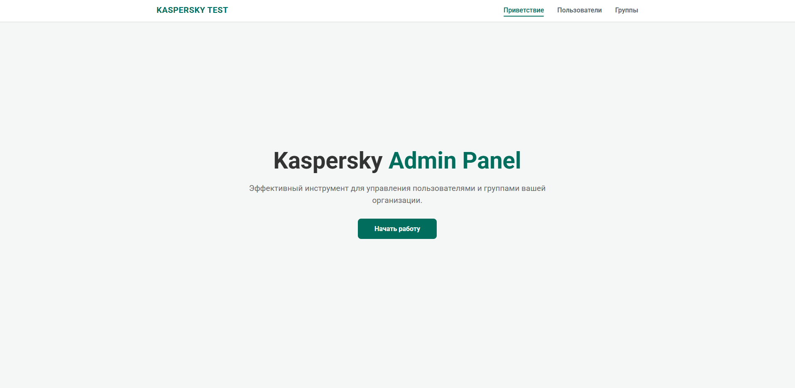
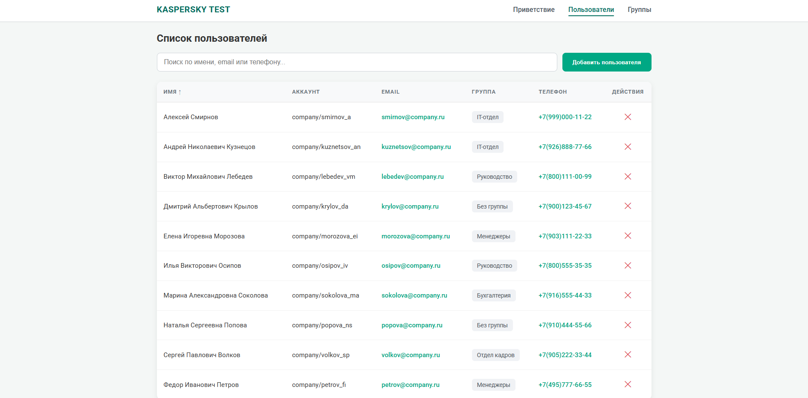
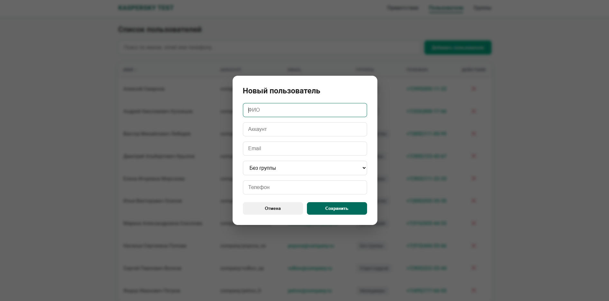
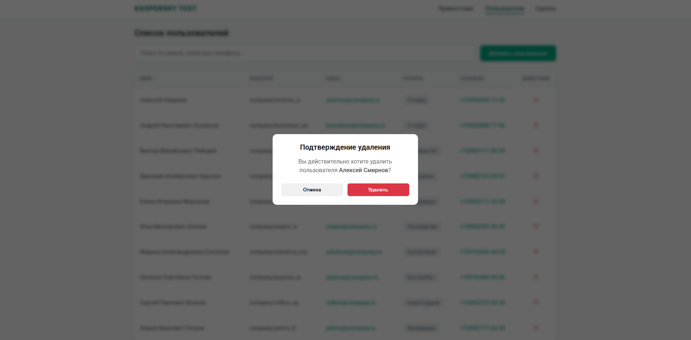
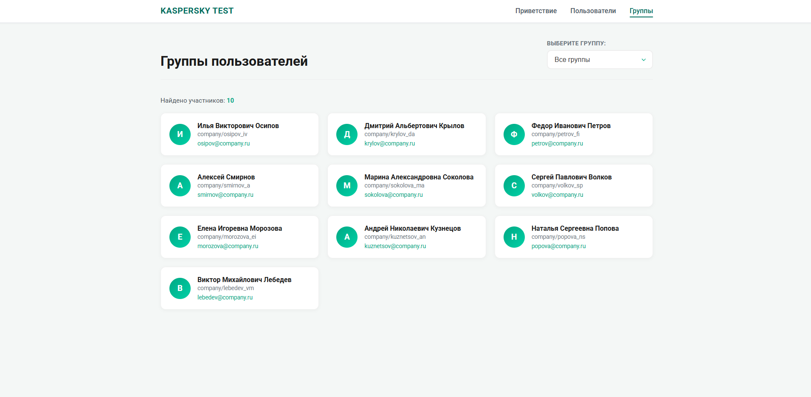
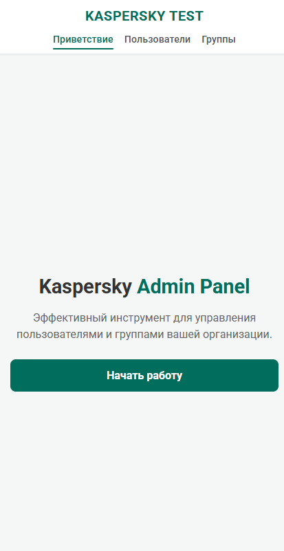
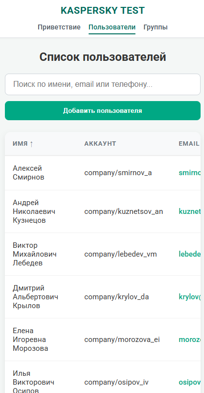
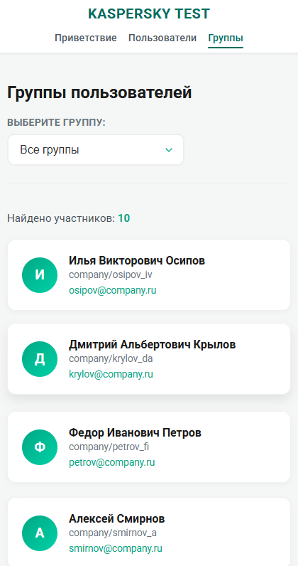

# 🛡️ Kaspersky Test React App

Тестовое задание: реализация админ-панели для управления пользователями и группами.

---

## 📌 Описание проекта

Приложение представляет собой SPA (Single Page Application), реализованное на React, позволяющее:

* Просматривать список пользователей
* Искать и сортировать пользователей
* Добавлять новых пользователей
* Удалять пользователей
* Группировать пользователей по отделам
* Просматривать пользователей внутри групп

Данные загружаются из mock JSON (`db.json`) и сохраняются в `localStorage`.

---

## 🧱 Архитектура проекта

Проект построен с использованием следующих подходов:

* **React (functional components + hooks)**
* **React Router DOM** — маршрутизация
* **Context API** — управление состоянием
* **CSS Modules** — изоляция стилей
* **BEM методология** — структурирование классов
* **Custom hooks** — переиспользуемая логика
* **Оптимизации через useMemo и debounce**
* **Mobile-first подход** — адаптивная верстка

---

## 🗂️ Структура проекта

```
src/
 ├── components/
 ├── pages/
 ├── context/
 ├── hooks/
 ├── routes/
 └── styles/
```

---

## 🧭 Роутинг

Реализован через `react-router-dom`.

### Доступные страницы:

* `/` — Welcome Page
* `/users` — Users Page
* `/groups` — Groups Page
* `*` — NotFound Page

---

## 🧠 Управление состоянием

### ❗ Почему отказался от localStorage-only подхода

Изначально данные хранились напрямую в `localStorage`, но это имело ряд проблем:

### ❌ Минусы localStorage:

* Нет единой точки правды
* Не реактивен (не вызывает перерендер)
* Возможны проблемы синхронизации
* Логика распределена по разным компонентам

---

### ✅ Решение: Context API

Был внедрён `UserContext`, который:

* Хранит пользователей в state
* Синхронизирует данные с localStorage
* Централизует бизнес-логику

```js
const { users, addUser, deleteUser } = useUsers();
```

### Преимущества:

* Единая точка правды
* Реактивность
* Чистая архитектура
* Удобство масштабирования

---

## ⚡ Загрузка данных

При первом запуске:

* происходит fetch из `db.json`
* данные сохраняются в Context
* затем кэшируются в localStorage

Добавлен флаг:

```
kaspersky_data_loaded
```

Чтобы избежать повторной загрузки.

---

## 🔍 Поиск и оптимизация

### Использован кастомный хук `useDebounce`

```js
const debouncedSearchTerm = useDebounce(searchTerm, 300);
```

### Зачем:

* уменьшение количества вычислений
* предотвращение лишних перерендеров
* улучшение UX при вводе

---

## ⚙️ Оптимизация через useMemo

```js
const filteredUsers = useMemo(() => { ... }, [...]);
```


### Зачем:

* предотвращение лишних вычислений
* ускорение сортировки и фильтрации
* масштабируемость при росте данных

---

## 📊 Таблица пользователей (UsersPage)

### Реализовано:

* Табличное отображение
* Сортировка по колонкам
* Поиск по:

  * имени
  * email
  * телефону
* Добавление пользователя
* Удаление пользователя

---

## ➕ Добавление пользователя

Через модальное окно:

* Валидация:

  * Email (regex)
  * Телефон (минимум 11 символов)
  * Обязательные поля
* После добавления:

  * пользователь подсвечивается
  * отображается toast-уведомление

---

## ❌ Удаление пользователя

* Подтверждение через модалку
* Используется `DeleteConfirmModal`
* Toast-уведомление после удаления

---

## 🔔 Уведомления

Используется `react-toastify`:

* Успешное добавление
* Удаление
* Ошибка загрузки

---

## 👥 Страница групп (GroupsPage)

⚠️ ВАЖНО: страница реализована с использованием LLM (по условию задания)

### Возможности:

* Выбор группы
* Фильтрация пользователей
* Отображение карточек пользователей

---

## 🤖 Сравнение: ручной UI vs LLM

| Критерий         | UsersPage (ручной) | GroupsPage (LLM)         |
| ---------------- | ------------------ | ------------------------ |
| Контроль         | Полный             | Ограниченный             |
| Оптимизация      | Высокая            | Средняя                  |
| UX               | Продуманный        | Быстрый, но менее точный |
| Время разработки | Дольше             | Быстрее                  |
| Гибкость         | Высокая            | Ограниченная             |

### Вывод:

* Ручная разработка даёт лучший контроль и качество
* LLM ускоряет разработку, но требует доработки

---

## 🎨 Стилизация

Использовано:

* CSS Modules
* BEM методология
* Переиспользуемые UI-компоненты

---

## 📱 Адаптивность (Mobile-first)

Приложение реализовано по принципу **mobile-first**:

* сначала проектировалась мобильная версия
* затем добавлялись улучшения для десктопа через media queries

### Особенности:

* адаптивная сетка (Flex + Grid)
* таблица с горизонтальным скроллом
* корректная работа на узких экранах
* упрощённая навигация

---

## 📸 Скриншоты

### 🖥️ Desktop

#### 🏠 Welcome Page



#### 👤 Users Page



#### ➕ Add User Modal



#### ❌ Delete Modal



#### 👥 Groups Page



---

### 📱 Mobile

#### 🏠 Welcome Page (Mobile)



#### 👤 Users Page (Mobile)



#### 👥 Groups Page (Mobile)



---


## 📌 Выводы

В ходе выполнения задания были:

* Реализованы CRUD-операции
* Оптимизирована производительность
* Применены современные подходы React
* Продемонстрированы навыки работы с архитектурой

### Главный вывод:

> Наиболее эффективный подход — комбинирование:
>
> * ручной разработки (для контроля и качества)
> * и LLM (для ускорения разработки и генерации UI)

---

## 👨‍💻 Автор

Mikhail Milyaev
